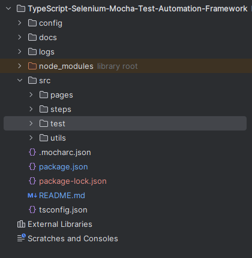

# Mitigram Assignment
## Introduction
This repository contains the Selenium test scenarios to test the 
Login flow of the Mitigram portal, the Careers page, and the Newsletter section.
## Supported Operating Systems
* Windows
* Linux
* Mac 
## Folder Structure
  
`src` is the root package of the core components of the framework.
### pages
This package contains the Page Classes following the 
Page Object Model (POM) design pattern.
### steps
This package contains the steps classes and these classes contain 
a set of methods that encapsulate specific interactions and validations 
related to the user interface. By using these methods, you can 
seamlessly create test cases for your automation suite.
### test
This package contains test cases
### utils
This package contains the utility classes.
## Prerequisites
Following dependencies should be installed before build and run the test suite.
* Node.js
## Check Node.js Installation
Run the command in a terminal
`node -v`. It should display the following output if you have installed Node.js properly.  
`v21.5.0` (The version can be different based on your installed version)
## Configure Test Suite (Before Run)
Open the file `config/config.json`.  
you can change SELENIUM_WAIT_TIMEOUT_IN_MILLISECONDS, SELENIUM_POLLING_INTERVAL_IN_MILLISECONDS and MOCHA_TIMEOUT configs if you want. These configs are used in selenium and mocha waits. Update the BROWSER configuration according to the browser you have. The default value is 'chrome'. Valid values: 'chrome', 'MicrosoftEdge', 'firefox', 'internet explorer', 'safari'.
## Build and Run Locally

#### Install dependencies
Run the command `npm install` in a terminal from the project root directory to install the dependencies.
#### Execute Testcases
##### Execute Full Suite
Run the command `npm test` 
in a terminal from the project root directory.
##### Execute specific test cases.
Run the command `npx mocha {path to the test file} -g "{test title}" --reporter mochawesome --reporter-options reportDir=testReports,reportFilename=testResults`
in a terminal from the project root directory. You have to update the {path to the test file} and {test title} according to the test case that you run.
ex: `npx mocha src/test/careersPageTests.ts -g "Validate engineering positions filtering" --reporter mochawesome --reporter-options reportDir=testReports,reportFilename=testResults`
##### View Test Results Report
Open the file `testReports/testResults.html` in a web browser to view the HTML test results report.
##### View Test Logs
Open the file `logs/mitigram-selenium-test.log` to view the outputs logged to the file.
